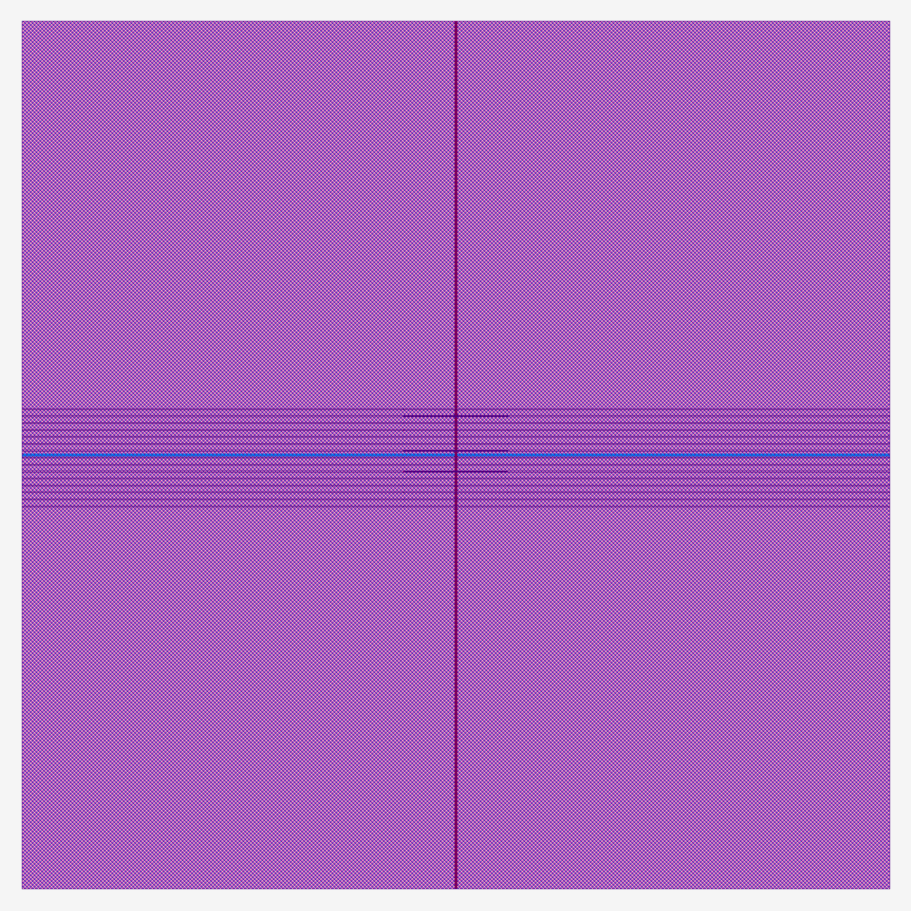

# Simon Says MPW die (simon_mpw_top) — hardening results and cost estimate

Reference run of `scripts/harden.sh` (ECC v0.1.0-alpha.12, ICS55 PDK v1.10.102,
`rtl2gds` preset, 100 MHz target, fixed 1000 × 1000 µm die = the smallest MPW
die, with the standard cells kept in a compact core in the middle of the die
because ECC's timing optimiser crashes when they are spread over the full
square millimetre). The deliverable for the MPW template is
`dist/simon_mpw_top.gds` (core-level GDS with pins on the die boundary; see
the pad-ring note in the README). Equivalence checks are proven with the LEC
pairing patch (see `docs/ecc-lec-note.md`). The ring-oscillator test structure
is compiled out (`RING_OSC = 0`).

Cost estimate for this variant (see the pricing notes below): ECOS Factory
prices MPW by die area ("scales with die area, est.") and issues the quote
after review; with no public ICS55 rate, comparable 55 nm MPW services put a
1 mm² die at roughly **¥30–40k (≈ $4–6k)**, i.e. one to two orders of
magnitude above the shared-chip variants. Open-source coupons of up to 100 %
are stated to be possible subject to review.

## simon_mpw_top — ICS55 hardening report

| Metric | Value |
| --- | --- |
| Die size | 1000.00 × 1000.00 µm |
| Die area | 1,000,000.00 µm² |
| Core area | 14,280.00 µm² |
| Core utilization | 23.00 % |
| Standard cell area | 3,770.00 µm² |
| Instances | 1,810 |
| Flip-flops / combinational | 196 / 1,359 |
| IO pins | 26 |
| Target clock | 10.00 ns |
| Achieved Fmax | 432.00 MHz |
| Setup / hold WNS | 7.68 ns / 0.09 ns |
| Routed wirelength | 34,716.81 µm |
| Total power (typ) | 0.23 mW |
| DRC | CLEAN (0 violations) |
| LVS | MATCHED (Clean) |
| QoR score | 49.40 |
| Flow runtime | 23m 20s |

| Corner | Setup WNS | Hold WNS | Status |
| --- | --- | --- | --- |
| MAX_125/Cworst | 7.68 ns | 0.27 ns | PASS |
| MAX_125/RCworst | 7.79 ns | 0.27 ns | PASS |
| WCL_m40/Cworst | 7.74 ns | 0.27 ns | PASS |
| WCL_m40/RCworst | 7.84 ns | 0.26 ns | PASS |
| TYP_25/TYPICAL | 8.8 ns | 0.15 ns | PASS |
| MIN_m40/Cworst | 9.21 ns | 0.09 ns | PASS |
| MIN_m40/RCworst | 9.24 ns | 0.09 ns | PASS |
| MIN_m40/Cbest | 9.25 ns | 0.09 ns | PASS |
| MIN_m40/RCbest | 9.23 ns | 0.09 ns | PASS |
| ML_125/Cworst | 9.11 ns | 0.1 ns | PASS |
| ML_125/RCworst | 9.14 ns | 0.1 ns | PASS |
| ML_125/Cbest | 9.15 ns | 0.1 ns | PASS |
| ML_125/RCbest | 9.13 ns | 0.1 ns | PASS |

## ECOS Factory pricing (public information, September 2026)

Source: https://factory.openecos.com (landing page `#pricing`, `/templates`,
`public-site-data/*/templates.json`, updated 2026-08-30) and
https://openecos.com/news/20250901_chip_poweron_and_tapeout/.

| Template | Public statement | Area | Handoff |
| --- | --- | --- | --- |
| MPC-Frame | "Cost: From $50 est." | 0.07 × 0.07 – 1 × 1 mm² | DEF + gate-level netlist |
| MPC-SoC | "Cost: Shared-chip slot (est.)" | 0.1 × 0.1 – 1 × 1 mm² | DEF + gate-level netlist |
| MPW | "Cost: Scales with die area (est.)" | from 1 × 1 mm² | one GDS |

Pricing model as stated by ECOS Factory:

- **MPC entry** — "Slots for tiny designs, with the final quote confirmed during shuttle ordering."
- **Area-based pricing** — "Price follows template and design size, then services during shuttle ordering."
- **Open-source incentives** — "Up to 100% coupons for eligible open-source and OSOC work, subject to review."
- All card figures are marked "est." until pricing and the MPC-SoC wrapper plan are finalized;
  the quote is issued inside the (login-only) order flow after signoff review.
- Previous run (ECOS55-2512): a free community tapeout area was offered for open-source
  designs under 100k instances, and packaged chips were announced at about ¥100 each.
- There is no public per-mm² rate for ICS55. Reference points for context only:
  Europractice 2026 GF 55 nm mini@sic €7,920/mm² (min 2.5 mm²), IHP SG13G2 €7,300/mm²,
  Chinese-market 55 nm MPW ≈ ¥30–40k/mm²; Tiny Tapeout SKY130 tile (~0.017 mm²) €70.

Shuttle **ECOS55-2610**: orders close 2026-09-27, signoff/GDS ready ≈ 2026-11,
tapeout 2027-01-31 (est.), shipping ≈ 2027-02-28 (est.).
